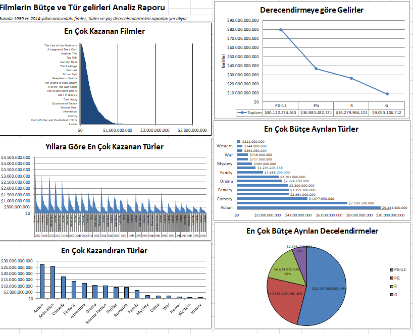

# 📊 Data Analytics Excel Project

Bu proje, Excel kullanarak temel veri analizi işlemlerini gerçekleştirmeyi amaçlamaktadır.

## 🔍 Proje İçeriği

- Veri temizleme (Data Cleaning)
- Filtreleme ve sıralama işlemleri
- Pivot tablolarla özetleme
- Grafikler ve görselleştirme
- Basit formüller ve istatistiksel analiz

## 🗂️ Kullanılan Araçlar

- Microsoft Excel
- PivotTable
- Grafikler (Sütun, Çizgi, Pasta vb.)

# 🚀 Nasıl Kullanılır?

1. Bu projeyi kendi bilgisayarına klonla:

```bash
git clone https://github.com/iamemirhancakir/data_analytics_excel_project.git
```
2. Excel dosyasını aç ve içeriğini incele
3. Dosyadaki yönlendirmeleri takip et


## 🖼️ Projeden Bir Görsel



# 📁 Dosya Yapısı
```markdown
data-analytics-excel-project/
├── dataset
└──Movies_gross_rating.csv
├── visuals
└──Analiz_raporu.png
├──movie_gross_revenue.xlxs
└── README.md
```

# ✍️ Katkıda Bulunmak
Katkı sağlamak istersen:
1. Fork'la
2. Yeni bir dal (branch) oluştur: ```git checkout -b feature/yenilik```
3. Değişikliklerini yap ve commit et
4. Pull Request gönder


# 📬 İletişim
Proje sahibi: Emirhan Çakır
LinkedIn:https://www.linkedin.com/in/iamemirhancakir
GitHub:https://github.com/iamemirhancakir

Teşekkür Ederim :)
